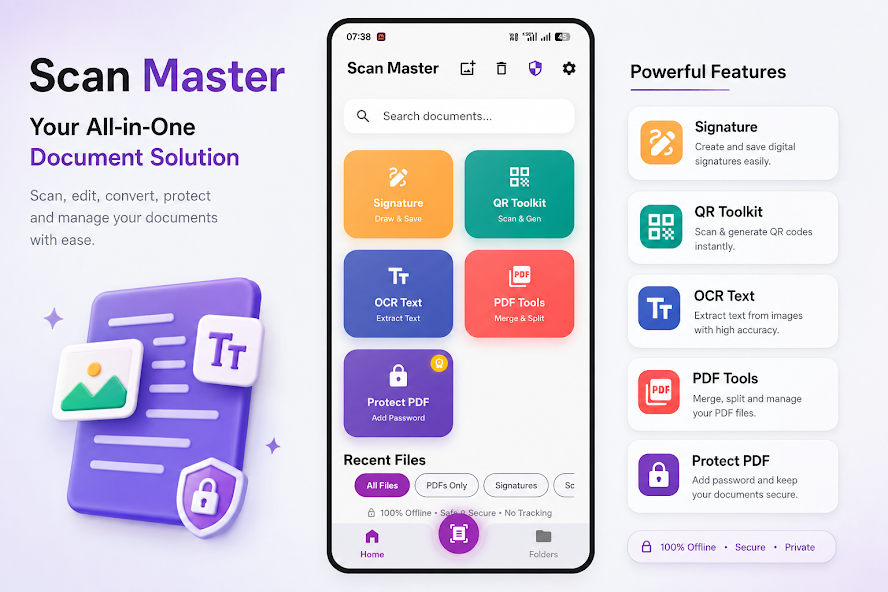

# Scan Master: 100% Offline Document Scanner for Android 📄🚀

  
  
  
  
  

Are you completely tired of seeing forced watermarks on your professional PDFs? Microsoft Lens officially retired in early 2026. You need a replacement fast. Scan Master solves this problem instantly by keeping your documents 100% offline and watermark-free. 

---

### Table of Contents
* Why are popular scanner apps actually dangerous for your privacy?
* What makes Scan Master different from the rest?
* Quick Feature Breakdown & Pros vs Cons
* Developer's Note: Behind the Code
* Frequently Asked Questions

---

## Why are popular scanner apps actually dangerous for your privacy?

Most famous scanner apps upload your tax forms and ID cards to random third-party servers. They steal your data right under your nose. And honestly, that is just unacceptable. 

*   They force you into crazy $30/year subscriptions just to remove a logo.
*   They bloat your phone with 150MB of garbage code and trackers.
*   They treat your private data as a product.

Think about it. You scan highly sensitive documents for work every single day. Do you really want a random cloud server holding your **private financial information**? Of course not.

## What makes Scan Master different from the rest?

So I decided to look for a real solution that respects your privacy. Scan Master processes every single page right there on your local storage. It just works. 

*   **100% Offline Processing:** You do not even need Wi-Fi to create a PDF.
*   **Zero Watermarks:** You get clean, professional exports every single time.
*   **Tiny Download Size:** The whole app takes up barely 30MB of space.

Plus, it cleans up dark shadows and finds paper edges perfectly. You point your camera at the receipt. The app does the rest. It feels like magic.

## Quick Feature Breakdown & Pros vs Cons

The best part? You get all the pro features without sacrificing your storage space.

| Feature | Scan Master | Most Competitors |
| --- | --- | --- |
| **Privacy Mode** | Local Storage Only | Cloud Uploads |
| **Watermark** | None | Forced Logo (Paid Removal) |
| **App Size** | Super tiny (30MB) | Huge (150MB+) |
| **Price** | Free | $30/year |

**Pros:**
*   Absolute privacy for your documents.
*   Lightning-fast PDF rendering.
*   No sneaky subscriptions to cancel later.

**Cons:**
*   No automatic cloud sync (this is intentional for privacy).
*   Available only on Android right now.

## Developer's Note: Behind the Code

I remember when I first tried to scan my own tax documents on my phone. The app I was using suddenly asked me to sign up for a cloud account and pay $30 a year just to export the PDF without a massive watermark blocking my signature. It was ridiculous. So, I sat down and built Scan Master entirely from scratch.

My goal was extremely simple: no cloud servers, no forced subscriptions, and absolute privacy. I spent weeks optimizing the edge-detection algorithm to work perfectly without needing an internet connection. For the latest update, I stripped out all the unnecessary background libraries. I shrank the entire app down to a tiny 30MB. 

But I didn't stop there. I personally fixed a frustrating PDF cropping bug that was affecting older Android devices. It runs flawlessly now. I originally made this tool for myself. But seeing thousands of people use it to protect their privacy **actually matters** more than anything.

## Frequently Asked Questions

**Q: Do I need an internet connection to save my PDF?**
A: No. Scan Master works completely offline to keep your files secure.

**Q: Will it put a watermark on my exported files?**
A: Never. You can export unlimited clean PDFs without any annoying logos.

**Q: Where can I download this safely?**
A: You can get it right now directly from the [Google Play Store](https://play.google.com/store/apps/details?id=com.scanmaster.scan_master_app) or read the full feature guide on our [official website](https://www.downloadkart.com/apps/scan-master-document-scanner).
